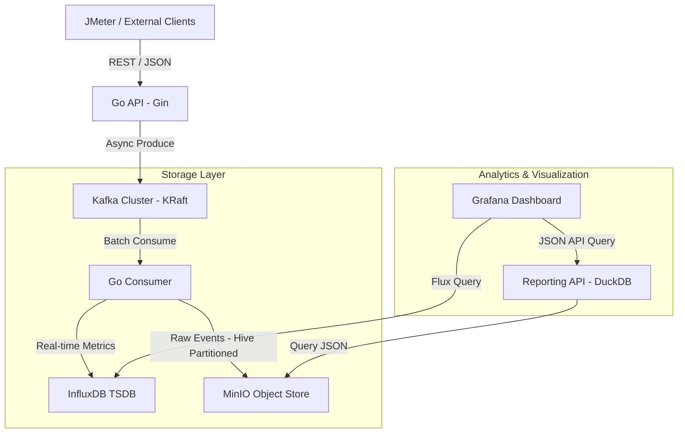

# Signal Catcher - Architecture Documentation

## 1. System Diagram

## 2. Technological Justification

- **Kafka (Apache):** Chosen for its ability to handle extremely high ingestion rates (1000+ rps) with durability. It decouples the API from the storage processing, ensuring low latency (<50ms).
- **InfluxDB:** Optimized for time-series data. It provides the high-performance aggregation needed for real-time dashboards (conversions, CTR, events/min).
- **MinIO + DuckDB:** MinIO provides cost-effective, long-term raw data storage. DuckDB acts as an "OLAP-on-S3" engine, allowing SQL queries on partitioned JSON files without the overhead of a traditional data warehouse.

## 3. Data Retention & Purgue Strategy

- **InfluxDB:** 7-day retention policy. Data is aggregated and then discarded to save disk space, as it is only needed for operational monitoring.
- **MinIO:** Permanent storage. Data is partitioned by `year/month/day/hour`. A lifecycle policy (S3 lifecycle) could be configured to move data to "Glacier-equivalent" storage after 30 days.

## 4. Alternatives Considered

- **RabbitMQ:** Discarded due to lower throughput and complexity in maintaining order at 1000+ rps compared to Kafka's partitioning.
- **Prometheus:** Considered for metrics, but discarded because it is "pull-based" and less flexible for event-level details (like conversion values) than InfluxDB.

## 5. AWS Monthly Cost Estimation (1000 RPS)

| Component | AWS Service | SKU / Configuration | Monthly Cost (Est.) |
| :--- | :--- | :--- | :--- |
| **Ingestion API** | AWS ECS Fargate | 2 vCPU, 4GB RAM (2 instances) | $96.00 |
| **Messaging** | Amazon MSK | kafka.m5.large (3 nodes) | $450.00 |
| **Consumer** | AWS ECS Fargate | 1 vCPU, 2GB RAM (3 instances) | $72.00 |
| **TSDB** | Amazon Timestream | 50GB storage + Query usage | $120.00 |
| **Object Store** | Amazon S3 | 500GB Standard + 2M PUT calls | $35.00 |
| **Visualization** | Managed Grafana | standard license | $9.00 |
| **Total** | | | **$782.00** |
